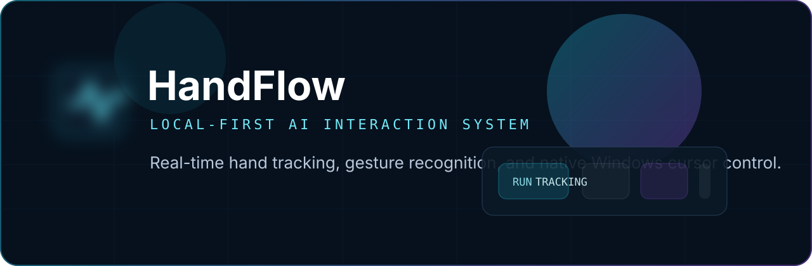

<p align="center">
  
</p>

<p align="center">
  <a href="https://github.com/ThatsPelle/HandFlow/releases"></a>
  
  
  
</p>

<p align="center">
  Local-first desktop hand tracking with real-time webcam interaction, gesture recognition, and native Windows cursor control.
</p>

## Overview

HandFlow is a futuristic webcam interaction app built with React, TypeScript, Vite, Framer Motion, and MediaPipe Hands. It runs fully on-device: webcam frames stay local, gesture processing stays in-browser, and Windows cursor control is handled by the bundled desktop shell.

## Highlights

| Area | What it does |
| --- | --- |
| Realtime tracking | Webcam stream + MediaPipe Hands + smoothed overlay rendering |
| Gesture engine | Pinch, open palm, and peace sign with stabilized state transitions |
| Native desktop control | Open palm to move pointer, pinch to click and drag on Windows |
| Local-first posture | No backend, no cloud inference, no server-side webcam handling |
| Desktop shell | WebView2 host, local static server, tray integration, exit confirmation |

## Quick Start

1. Install dependencies:

```bash
npm install
```

2. Start web development mode:

```bash
npm run dev
```

3. Build Windows desktop release:

```bash
npm run desktop:publish
```

4. Launch desktop app:

```text
release/HandFlow-win-x64/HandFlow.Companion.exe
```

## Interaction Flow

1. Open HandFlow desktop app.
2. Pick the webcam device from the camera button in the bottom dock.
3. Press `Run` to start local tracking.
4. Enable pointer control when you want OS cursor movement.
5. Use open palm to move and pinch to click or drag.
6. Press `Ctrl+Alt+H` to pause or resume native pointer control.

## Local-First Posture

Webcam frames are captured with browser APIs and remain on the user device. MediaPipe WASM and the hand landmark model are served from `public/mediapipe`, so runtime hand tracking does not require a backend, external AI API, cloud transport, or server-side video processing.

## Repo Layout

- `src/pages` composes the main application surface.
- `src/components` contains layout, HUD, onboarding, and webcam UI.
- `src/hooks` isolates webcam lifecycle and overlay loop bindings.
- `src/services` owns webcam access, tracking, gesture processing, and pointer bridging.
- `src/types` contains shared tracking and telemetry contracts.
- `src/utils` contains pure helpers and local runtime utilities.
- `companion/HandFlow.Companion` contains the Windows desktop host.

## Commands

```bash
npm test
npm run lint
npm run build
npm run desktop:publish
npm run clean:desktop
```

## Release Notes

- Release output is generated in `release/HandFlow-win-x64/`.
- Do not commit `dist/`, `dist-desktop/`, `release/`, `node_modules/`, `companion/**/bin/`, `companion/**/obj/`, or `*.WebView2/`.
- Publish desktop binaries through GitHub Releases, not git history.
